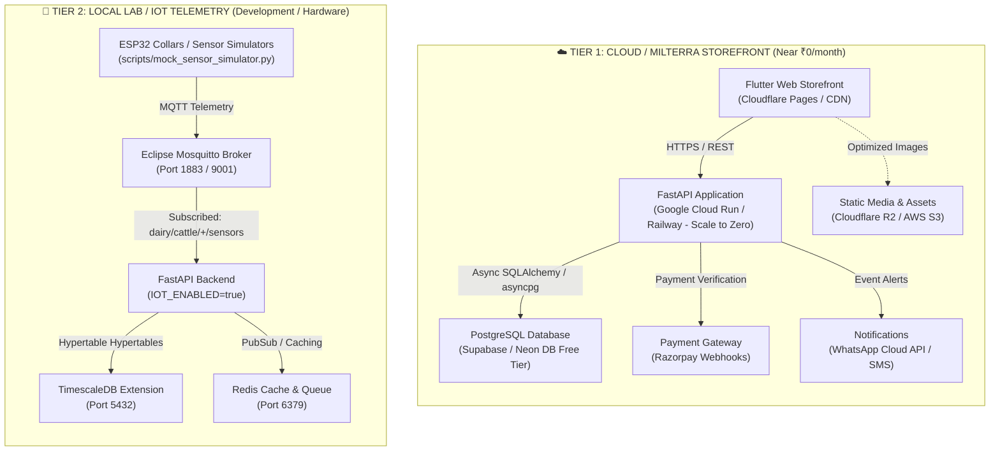
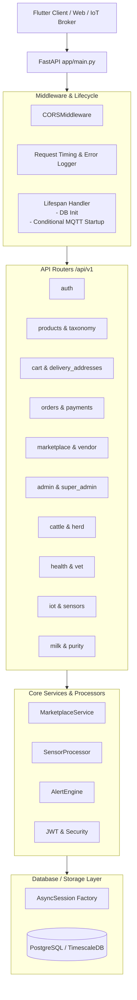
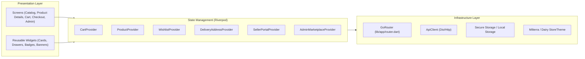
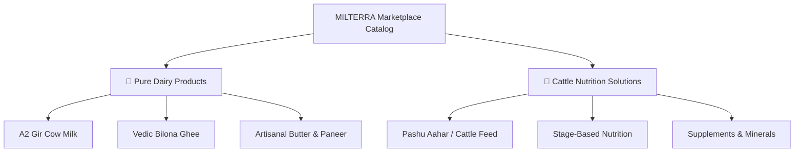

# DairyAI & MILTERRA — System Architecture Specification

## 1. Executive Architecture Overview

DairyAI / MILTERRA is engineered as a full-stack, two-tier platform designed to support both high-performance e-commerce and cutting-edge IoT cattle telemetry while strictly managing operational cost.

The architecture cleanly decouples into two operational tiers:
1. **Cloud / MILTERRA Storefront Tier** — Zero/low-cost, high-velocity consumer e-commerce storefront operating on serverless, scale-to-zero infrastructure.
2. **Local Engineering Lab Tier** — Deep cattle telemetry and IoT collar simulation environment running time-series analysis and MQTT brokering locally.



---

## 2. Two-Tier Operational Model

### Tier 1: Cloud / MILTERRA Storefront (Production Mode)
- **Target Workload**: Consumer & Farmer e-commerce (Pure Dairy products, cattle feed concepts, marketplace).
- **Cost Profile**: Near **₹0/month** by leveraging scale-to-zero serverless compute and global CDN caching.
- **Enabled Feature Flags**:
  - `IOT_ENABLED=false`
  - `MQTT_ENABLED=false`
  - `REDIS_ENABLED=false`
  - `TIMESCALE_FEATURES_ENABLED=false`
- **Zero Cold-Start Dependency**: FastAPI boots unconditionally without waiting on MQTT brokers or Redis caches.

### Tier 2: Local Lab / Cattle Health Tracker (Engineering Mode)
- **Target Workload**: ESP32 smart collar development, sensor anomaly detection, real-time vitals processing, and time-series aggregation.
- **Orchestration**: Docker Compose with profiles (`docker compose --profile iot up`).
- **Enabled Feature Flags**:
  - `IOT_ENABLED=true`
  - `MQTT_ENABLED=true`
  - `REDIS_ENABLED=true`
  - `TIMESCALE_FEATURES_ENABLED=true`

---

## 3. Backend Architecture (FastAPI)



### Key Modules & Responsibilities:
- **`backend/app/main.py`**: Lifespan startup/shutdown, router registration, request logging middleware, global exception handlers.
- **`backend/app/config.py`**: Pydantic `BaseSettings` reading environment variables with strict production validation rules (e.g. minimum 32-char JWT secret, explicit HTTPS origins).
- **`backend/app/database.py`**: Async SQLAlchemy engine (`asyncpg`) and sessionmaker with connection pooling.
- **`backend/app/iot/mqtt_client.py`**: Non-blocking MQTT subscriber running on the async event loop with auto-reconnect and database isolation.
- **`backend/app/iot/sensor_processor.py`**: Ingests temperature, heart rate, rumination, and activity vitals; calculates health anomaly alerts.

---

## 4. Frontend Architecture (Flutter Web & Mobile)



### Storefront Design Principles:
1. **Distinction between Verified Dairy & Nutrition Concepts**:
   - **Verified Pure Dairy**: Fully commercialized with pricing, inventory, Add-to-Cart, instant checkout, and purity certification batches.
   - **Animal Nutrition Concepts (MILTERRA)**: Displayed as R&D concept previews with clear `Concept Preview` and `In Development` badges; commercial purchasing controls are disabled while gathering farmer feedback.
2. **Performance Optimizations**:
   - Web image asset resolution fallback (local asset images with network URL fallbacks).
   - Optimistic UI updates on cart operations and wishlist toggling.
   - Zero-blocking page transitions via GoRouter.

---

## 5. Catalog & Commerce Taxonomy

The commerce engine supports a dual-taxonomy structure:



---

## 6. Docker Compose Configuration & Profiles

The Docker Compose configuration (`infra/docker-compose.yml`) leverages Docker compose profiles to support the Two-Tier architecture:

```yaml
version: "3.9"

services:
  postgres:
    image: timescale/timescaledb:latest-pg16
    container_name: dairy_ai_postgres
    ports:
      - "5432:5432"
    environment:
      POSTGRES_USER: dairy
      POSTGRES_PASSWORD: dairy123
      POSTGRES_DB: dairy_ai
    volumes:
      - postgres_data:/var/lib/postgresql/data

  redis:
    image: redis:7-alpine
    container_name: dairy_ai_redis
    ports:
      - "6379:6379"
    profiles:
      - iot
      - all

  mosquitto:
    image: eclipse-mosquitto:2
    container_name: dairy_ai_mosquitto
    ports:
      - "1883:1883"
      - "9001:9001"
    volumes:
      - ./mosquitto/mosquitto.conf:/mosquitto/config/mosquitto.conf
    profiles:
      - iot
      - all

  backend:
    build:
      context: ../backend
      dockerfile: Dockerfile
    container_name: dairy_ai_backend
    ports:
      - "8000:8000"
    depends_on:
      - postgres
    env_file:
      - ../.env

volumes:
  postgres_data:
```

### Execution Commands:
- **Core Mode (E-Commerce only)**:
  ```bash
  docker compose up -d
  ```
- **IoT / Local Lab Mode (Full stack with MQTT & Redis)**:
  ```bash
  docker compose --profile iot up -d
  ```

---

## 7. Environment Variables & Feature Flags

| Variable | Type | Default (Dev) | Production Recommendation | Purpose |
|---|---|---|---|---|
| `APP_ENV` | String | `development` | `production` | Application environment mode |
| `LOG_LEVEL` | String | `INFO` | `WARNING` / `INFO` | Log verbosity |
| `DATABASE_URL` | String | `postgresql+asyncpg://...` | Supabase / RDS async URL | Async database connection string |
| `IOT_ENABLED` | Boolean | `true` | `false` | Global toggle for IoT pipelines |
| `MQTT_ENABLED` | Boolean | `true` | `false` | Connects MQTT subscriber if true |
| `REDIS_ENABLED` | Boolean | `false` | `false` | Redis queue & cache integration |
| `TIMESCALE_FEATURES_ENABLED` | Boolean | `false` | `false` | TimescaleDB specific hypertables |
| `JWT_SECRET` | String | Demo key | 32+ character random secret | Authentication token signer |
| `CORS_ORIGINS` | String | `http://localhost:...` | `https://milterra.in` | Explicit allowed web origins |
| `INIT_DB_ON_STARTUP` | Boolean | `true` | `false` | Auto create schemas vs migrations |

---

## 8. Synthetic IoT Sensor Simulation

To simulate real-time cattle sensor collars without physical hardware, run the test simulator:

```bash
# Publish synthetic vitals via MQTT to Mosquitto
python backend/scripts/mock_sensor_simulator.py

# Simulate a fever/mastitis alert scenario
python backend/scripts/mock_sensor_simulator.py --scenario sick

# Direct REST ingestion mode (no MQTT broker needed)
python backend/scripts/mock_sensor_simulator.py --http
```

---

## 9. Launch Gates & Production Readiness Checklist

- [x] **Two-Tier Architecture separation** implemented and tested.
- [x] **Backend graceful startup**: MQTT and Redis decoupled from critical path.
- [x] **Product catalog separation**: Pure Dairy (commercial) vs Cattle Nutrition (concept preview).
- [x] **Admin & Seller management**: Product, pricing, deal, and inventory controls ready.
- [x] **Cart & Checkout workflows**: Cart drawer, checkout, delivery addresses, and order repository wired.
- [x] **Static code analysis**: 0 errors, 0 warnings on Flutter and backend modules.
