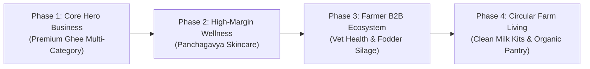

# Milterra & Dairy AI: Future Platform Expansion Roadmap

> **Status:** Future Phase / Post-Ghee Scale Planning  
> **Primary Business Focus:** Premium Ghee Multi-Category Dominance  
> **Last Updated:** September 2026

This document preserves the strategic evaluation and product blueprints for secondary business verticals to be introduced after achieving market leadership in the core **Premium Ghee** sector.

---

## Strategic Growth Horizon

---

## 1. Panchagavya Wellness & Ayurvedic Personal Care (Phase 2)

* **Target Audience:** Urban retail consumers, clean-beauty seekers.
* **Margin Profile:** 65% – 75% gross margin.
* **Brand Synergies:** Uses surplus A2 cow ghee and farm by-products into high-ticket natural personal care (*Gau Saundarya*).

### Candidate Assortment
1. **Shata Dhauta Ghrita (100-Times Washed Cow Ghee Cream):**
   - *Description:* Organic A2 cow ghee washed 100 times in a copper vessel with purified water. Transforms ghee into a non-greasy, deeply penetrating moisturizer.
   - *Use Case:* Premium night cream, anti-aging, eczema and skin barrier repair.
2. **Panchagavya Handcrafted Herbal Soaps:**
   - *Description:* Cold-processed bathing bars crafted from Gir cow ghee, Gomaye ash, Multani mitti, cold-pressed coconut oil, and neem/tulsi extracts. Free from sulfates, parabens, and synthetic foam boosters.
3. **Shuddha Gomutra Arka (Purified Distilled Cow Extract):**
   - *Description:* Traditionally distilled indigenous cow urine extract infused with ginger, tulsi, and giloy.
   - *Use Case:* Immunity detox tonic and Ayurvedic therapeutic booster.
4. **Vedic Cow Ghee Lip Salve & Heel Balm:**
   - *Description:* Pure A2 cow ghee blended with organic beeswax and kokum butter for chapped lips and cracked winter heels.

---

## 2. Veterinary Health, First-Aid & Hygiene (Phase 3A)

* **Target Audience:** Dairy farmers, cattle herd owners, cooperative members.
* **Margin Profile:** 40% – 50% gross margin.
* **Platform Synergy:** Direct integration with the **Tele-Veterinary Clinic** module in the Dairy AI mobile app—prescriptions flow directly into cart orders.

### Candidate Assortment
1. **Mastitis Prevention & Early Detection Kit:**
   - California Mastitis Test (CMT) paddle and reagent liquid.
   - Post-milking food-grade herbal teat dip cup and solution.
2. **Herbal Anti-Maggot Wound Spray:**
   - Fast-acting herbal aerosol (Topicure / Charmil formulation) for maggoted wounds, cuts, horn injuries, and foot lesions.
3. **Natural Ectoparasite Dusting Powder & Drench:**
   - Non-toxic, herbal tick, flea, and lice repellent safe for lactating cattle with zero milk-withdrawal penalty.
4. **Post-Calving Herbal Uterine Cleanser:**
   - Oral uterine involution and restorative tonic (Expar/Uterotone alternative) ensuring rapid placenta shedding and uterus cleansing.
5. **Summer Electrolyte & Anti-Stress Powders:**
   - Water-soluble electrolytes, buffered minerals, and vitamin C to prevent summer milk yield crashes.

---

## 3. Green Fodder Genetics & Preserved Silage (Phase 3B)

* **Target Audience:** Dairy farmers facing seasonal green grass shortages.
* **Margin Profile:** 25% – 35% gross margin (high repeat frequency).
* **Platform Synergy:** Directly increases milk volume and Fat/SNF intake at cooperative milk collection points.

### Candidate Assortment
1. **High-Yield Perennial Grass Stems / Root Cuttings:**
   - Super Napier (Pakchong 1), Hybrid Napier, and Co-4 fodder cuttings.
2. **High-Protein Legume Seeds:**
   - Multi-cut Berseem (Egyptian Clover), Lucerne (Alfalfa), and SSG Multi-Cut Sweet Sorghum seeds.
3. **Vacuum-Packed Sweet Corn Silage (50 kg / 100 kg Bales):**
   - Mechanized, lactic-fermented whole-corn plant silage with high starch content, enabling year-round high milk yield without irrigated green pasture.
4. **Natural Rock Salt & Mineral Lick Blocks (Sendha Namak Bricks):**
   - 5 kg hanging mineral lick blocks with copper, zinc, and selenium for open pens.

---

## 4. Pure Farm Pantry & Cold-Pressed Staples (Phase 4A)

* **Target Audience:** Existing Milterra Ghee household buyers seeking unadulterated kitchen essentials.
* **Margin Profile:** 35% – 45% gross margin.

### Candidate Assortment
1. **Cold-Pressed / Kachi Ghani Mustard Oil (Sarson Tel):**
   - Traditional wood-pressed yellow mustard oil with high pungency and low erucic acid.
2. **Raw Wild Forest Honey:**
   - Unheated, unfiltered single-origin honey from floral belts.
3. **Organic Pink Rock Salt (Sendha Namak):**
   - Mineral-rich culinary rock salt for satvik fasting and everyday cooking.
4. **Authentic Vedic Dahi (Curd) Starter:**
   - Freeze-dried heirloom bacterial cultures for thick, gut-friendly home dahi.

---

## 5. Clean Milk Production & Biosecurity Kits (Phase 4B)

* **Target Audience:** Village milk collection centres, dairy societies, and ambitious progressive farmers.
* **Margin Profile:** 30% – 40% gross margin.

### Candidate Assortment
1. **SS 304 Seamless Milking Pails (Buckets):**
   - Hooded, hygienic pails preventing dung and dust contamination during hand milking.
2. **Double-Mesh Stainless Steel Strainers & Disposable Filter Discs.**
3. **Milk Stone Remover & Food-Grade CIP Cleaners:**
   - Alkaline and acid cleaners to descale milk cans, chillers, and milking machines.
