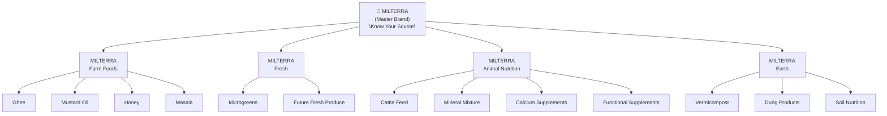
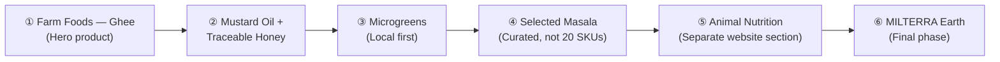

# MILTERRA Brand Architecture

> **Master Brand Promise:** MILTERRA — Know Your Source.
>
> MILTERRA = Trusted products originating from farms, soil, and animals.

---

## 1. Brand Structure Overview

MILTERRA is a **master brand**, not a product category. It covers four clearly separated divisions under a single unified identity. Each division uses the same MILTERRA logo with the division name set below it — not four separate logos.



---

## 2. The Four Divisions

| Division | Products | Audience |
|---|---|---|
| **MILTERRA Farm Foods** | Ghee, mustard oil, honey, masala | Families, home cooks, health-conscious consumers |
| **MILTERRA Fresh** | Microgreens, future fresh produce | Urban households, health & wellness segment |
| **MILTERRA Animal Nutrition** | Cattle feed, mineral mixture, calcium, functional supplements | Dairy farmers, livestock owners |
| **MILTERRA Earth** | Vermicompost, dung products, soil nutrition | Farmers, gardeners, organic growers |

---

## 3. Label Architecture

The same visual hierarchy applies across all divisions:

```
MILTERRA              ← Master brand (large, prominent)
FARM FOODS            ← Division (smaller, below)
Cultured Sahiwal Cow Ghee   ← Product name
```

### Farm Foods examples

```
MILTERRA
FARM FOODS
Cultured Sahiwal Cow Ghee

MILTERRA
FARM FOODS
Kachi Ghani Mustard Oil

MILTERRA
FARM FOODS
Farm Turmeric Powder
```

### Animal Nutrition example

```
MILTERRA
ANIMAL NUTRITION
Balanced Dairy Cattle Feed
```

This way a customer immediately recognises the same company, while ghee never looks like it belongs to a cattle-feed brand.

---

## 4. Visual Identity per Division

| Division | Primary Colours | Character |
|---|---|---|
| **Farm Foods** | Dark green, cream, gold | Warm, premium, trusted |
| **Fresh** | Light leaf green | Clean, crisp, alive |
| **Animal Nutrition** | Deep green + blue/teal | Professional, scientific, farm-facing |
| **Earth** | Olive green + natural brown | Grounded, organic, earthy |

> [!IMPORTANT]
> Do **not** create four separate logos. Keep one MILTERRA wordmark. Only the division name and colour palette change per division.

---

## 5. Website Structure

The website should route customers by their primary need:

### For Your Family
- Ghee
- Mustard Oil
- Honey
- Masala
- Microgreens

### For Your Farm
- Cattle Feed
- Supplements
- Minerals
- Farm Equipment

### For Your Soil
- Vermicompost
- Organic Manure
- Soil-Care Products

> [!NOTE]
> The "For Your Farm" and "For Your Soil" sections should be visually distinct from the consumer food sections. Farm-facing communication should feel professional and data-oriented.

---

## 6. Rollout Sequence

Do **not** launch all divisions simultaneously. Prioritise depth over breadth.



> [!CAUTION]
> Do **not** position the company as "a ghee brand." Position it as a **transparent farm-to-family brand** with ghee as its first flagship product.

---

## 7. Unifying Promise

> **MILTERRA — Know Your Source.**

This promise works across every division — milk, ghee, oil, honey, spices, microgreens, animal nutrition, and soil products — as long as the genuine source and process can be shown and verified.

---

## 8. Trademark & IP Note

Trademark protection is **separate from brand architecture.** The MILTERRA master name can remain one registered trademark, but protection for different product categories (food, animal feed, soil products) may need to be expanded gradually as each division launches.

---

## 9. Alignment with Existing Architecture

This document **supersedes** the single-category ghee focus in [`PREMIUM_GHEE_MULTICATEGORY_ARCHITECTURE.md`](file:///c:/dileepkm/Learning/dairy_ai-with-backend/docs/PREMIUM_GHEE_MULTICATEGORY_ARCHITECTURE.md).

The five ghee sub-categories defined there remain valid — they now sit **within MILTERRA Farm Foods** as the hero product line, not as the entire company scope.

| Previous framing | Current framing |
|---|---|
| Milterra = premium ghee brand | Milterra = transparent farm-to-family master brand |
| Ghee is the company | Ghee is the first flagship of Farm Foods division |
| One product taxonomy | Four divisions, one master brand |
| Colour: dark green/gold only | Division-specific colour palettes under one identity |
