# Milterra Premium Ghee: Multi-Category Product Architecture

> **Core Strategic Decision:** Ghee is not a single product; it is the **Core Hero Business Engine** of Milterra.  
> **Brand Vision:** Build India's premier, single-estate and multi-breed artisanal Ghee marketplace.

---

## 1. Executive Summary

Focusing exclusively on **Premium Ghee** gives Milterra a defensible, high-margin, and highly focused direct-to-consumer (D2C) identity. The Indian ghee market exceeds \$40B+, with the premium A2/bilona segment growing at over **28% CAGR**. 

Rather than diluting the brand across multiple unrelated farm products, Milterra will segment Ghee into **5 distinct sub-categories** targeting different consumer personas, price points, and functional use-cases.

---

## 2. The 5 Multi-Categories of Ghee

```mermaid
graph TD
    Root["Milterra Premium Ghee Ecosystem"]
    Root --> Cat1["1. Indigenous Breed-Specific A2 Ghee"]
    Root --> Cat2["2. Traditional Murrah Buffalo Ghee"]
    Root --> Cat3["3. Ayurvedic Medicated Ghrita (Functional Health)"]
    Root --> Cat4["4. Celestial & Single-Estate Reserve"]
    Root --> Cat5["5. Gourmet & Culinary Infused Ghee"]

    Cat1 --> P1["Sahiwal A2 Bilona Ghee"]
    Cat1 --> P2["Gir Cow Golden Bilona Ghee"]
    Cat1 --> P3["Badri Himalayan Herb-Grazed Ghee"]

    Cat2 --> P4["Murrah Buffalo Granular (Danedaar) Ghee"]
    Cat2 --> P5["Smoked Dhungar Buffalo Ghee"]

    Cat3 --> P6["Brahmi Ghrita (Memory & Focus)"]
    Cat3 --> P7["Ashwagandha Ghrita (Stamina & Stress)"]
    Cat3 --> P8["Himalayan Turmeric & Black Pepper Golden Ghee"]

    Cat4 --> P9["Sharad Purnima (Full Moon) Batch Ghee"]
    Cat4 --> P10["Single-Estate Traceable Vintage Ghee"]
    Cat4 --> P11["Vedic Hawan & Yajna Sacred Ghee"]

    Cat5 --> P12["Roasted Garlic & Herb Ghee"]
    Cat5 --> P13["Kashmiri Chilli & Sea Salt Ghee"]
```

---

## 3. Detailed Sub-Category Breakdown

### Category 1: Indigenous Breed-Specific A2 Ghee *(Heritage B2C)*
Different desi cow breeds have unique fat globules, beta-carotene contents, and historical terroirs:
* **Milterra Sahiwal A2 Bilona Ghee (Punjab/UP Origin):**
  * *Characteristics:* Gentle, sweet aroma, velvety smooth golden texture, low melting point. The ultimate everyday nutrition ghee for kids and elders.
* **Milterra Gir Cow Vedic Bilona Ghee (Gujarat Origin):**
  * *Characteristics:* High beta-carotene (deep amber hue), churned from Gir cows known for the *Surya Ketu Nadi* solar vein. Positioned as a luxury golden nectar.
* **Milterra Badri Cow Himalayan Ghee (Uttarakhand Origin - High Altitude):**
  * *Characteristics:* Small-framed indigenous cows grazing on wild high-altitude Himalayan herbs and shrubs (Jhingan, Oak, medicinal grasses). Super-premium niche.

---

### Category 2: Traditional Cultured Buffalo Ghee *(Culinary Danedaar)*
Many North and West Indian households prefer buffalo ghee for sweets, parathas, and high-heat cooking due to its high smoke point and distinctive grain:
* **Murrah Buffalo Cultured Danedaar Ghee:**
  * *Characteristics:* 100% white, crystalline, coarse granular (*Danedaar*) texture with 99.8% milk fat. Superior consistency for making authentic besan ladoos, halwa, and dal tadka.
* **Smoked Dhungar Buffalo Ghee:**
  * *Characteristics:* Prepared using the traditional royal *Dhungar* technique (ghee infused with live cow-dung charcoal and cloves in an earthen pot). Gives an authentic wood-fired rustic aroma to rice and rotis.

---

### Category 3: Ayurvedic Medicated Ghrita *(Functional Wellness & Nootropics)*
In Ayurveda, ghee is the ultimate *Yogavahi* (catalyst/carrier) that transports active herbal compounds deep into lipid-soluble cellular membranes and across the blood-brain barrier:
* **Brahmi Ghrita (Cognitive & Mental Clarity):**
  * *Formula:* A2 bilona ghee slow-clarified with organic *Bacopa monnieri* (Brahmi) juice.
  * *Consumer Need:* Students, professionals, memory support, and deep sleep.
* **Ashwagandha & Shatavari Ghrita (Vitality & Reproductive Balance):**
  * *Formula:* Infused with *Withania somnifera* and *Asparagus racemosus*.
  * *Consumer Need:* Adrenal fatigue, stress relief, postpartum rejuvenation, hormonal balance.
* **Golden Turmeric & Black Pepper Ghee (Haldi-Mirch Ghrit):**
  * *Formula:* Organic Lakadong turmeric (9%+ curcumin) paired with Tellicherry black pepper piperine infused into warm bilona ghee.
  * *Consumer Need:* Joint mobility, inflammation relief, golden latte / turmeric milk booster.

---

### Category 4: Celestial & Single-Estate Reserve *(Artisanal Luxury)*
* **Sharad Purnima (Full Moon) Batch Ghee:**
  * *Concept:* Churned exclusively on full moon nights (*Shukla Paksha*) when lunar rays (*Chandra Rashmi*) are believed to impart cooling, satvik medicinal properties. Produced in numbered batches once a month.
* **Single-Estate Single-Herd Vintage Ghee:**
  * *Concept:* Milk sourced exclusively from a single verified estate herd with 100% pasture grazing traceability. Includes farm batch QR codes showing cow health and grazing logs.
* **Vedic Hawan & Yajna Sacred Ghee:**
  * *Concept:* Specially prepared pure Desi Cow ghee intended for rituals, homams, agnihotra, and akhand jyot with 100% smoke-free golden flame.

---

### Category 5: Gourmet Culinary Infused Ghee *(Modern Urban Pantry)*
Replaces imported cooking butters with shelf-stable, high-smoke-point (250°C) artisanal finishing fats:
* **Roasted Garlic & Himalayan Pink Salt Ghee:**
  * *Use Case:* Spread for warm sourdough, garlic bread, sautéing mushrooms, brushing naans.
* **Kashmiri Chilli & Rosemary Basting Ghee:**
  * *Use Case:* Pan-basting paneer tikka, grilled vegetables, roasts, and rice bowls.

---

## 4. Packaging, Formats & Gifting Strategy

| Format | Pack Size | Target Persona | Packaging Type |
|---|---|---|---|
| **Discovery Trio Sampler** | 3 × 150 ml | First-time buyers / Gifting | Wooden presentation box with brass tasting spoon |
| **Everyday Family Jar** | 500 ml / 1000 ml | Household cooking | Hexagonal flint glass jar with wide-mouth wooden dipper |
| **Heritage Storage Tin** | 5 Litres | Joint families / Sweet makers | Food-grade heritage vintage brass/tin canister |
| **Single-Dose Ritual Sachet** | 15 ml (Pack of 30) | Travellers / Daily morning warm-water drink | Recyclable easy-tear food-grade pouches |

---

## 5. Platform Architecture Alignment

The backend commerce taxonomy (`commerce_taxonomy_nodes`) and mobile navigation are already equipped to support this hierarchy:
* **Department:** `Ghee Collection` (or `Milterra Pure Ghee`)
  * **Category 1:** `A2 Indigenous Cow Ghee`
  * **Category 2:** `Cultured Buffalo Ghee`
  * **Category 3:** `Ayurvedic Medicated Ghrita`
  * **Category 4:** `Celestial & Limited Batches`
  * **Category 5:** `Gourmet Infused Ghee`

This positioning elevates Milterra from a general commodity seller into an authoritative, world-class **D2C House of Artisanal Ghee**.
